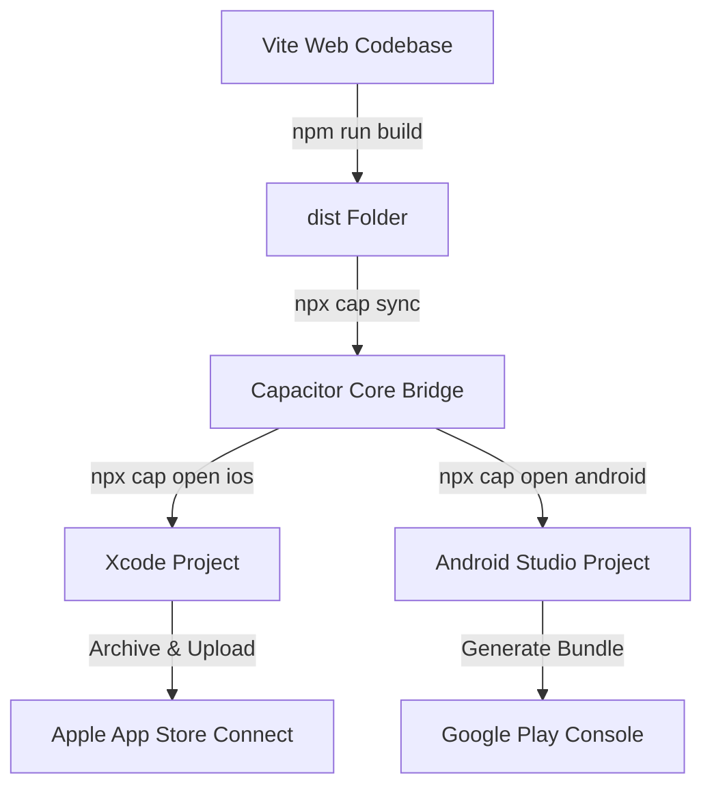

# <p align="center"><br />Petal & Parchment</p>

<p align="center">
  <strong>A Cozy, Whimsical Botanical Journal & AI Diagnostics Sanctuary</strong>
</p>

<p align="center">
  
  
  
  
  
</p>

---

## 🌸 Welcome to the Conservatory

**Petal & Parchment** is a premium, mobile-first botanical assistant designed like an editorial, cozy vintage journal. Combining nostalgic, handwritten ledger designs with advanced plant pathology AI models, Petal & Parchment helps you track, cultivate, and diagnose your indoor sanctuary with aesthetic elegance and zero friction.

Unlike sterile, generic utility apps, Petal & Parchment wraps your care routines in warm HSL tones, dewy glassmorphism, smooth micro-animations, and a dynamic editorial color theme inspired by soft peony petals, porcelain clay, and deep midnight espresso.

---

## ✨ Whimsical Features

### 🌿 1. Cozy Conservatory Dashboard
*   **Tactile Health Grid:** A beautiful, responsive card layout showing all your active plants, their customized profiles, and instant health diagnostics.
*   **Theme-Aware Contrast Badges:** Plant health percentage pills automatically adapt. Renders a delicate warm off-white in light mode, and a soft, low-opacity translucent glass badge in dark mode to ensure beautiful, high-contrast readability of your garden's status.

### 📔 2. Care Tasks Journal (Dynamic Lined Notebook)
*   **Analog Lined Aesthetic:** Daily care checklists are laid out on a gorgeous, vintage lined notepad featuring a vertical pink margin rule and subtle, dashed guides.
*   **Zero-Glare Dark Mode:** When toggled to dark mode, the notebook dynamically transitions from a morning porcelain cream paper to a deep, luxurious **Midnight Espresso Diary Page** (`rgba(41, 35, 30, 0.95)`), protecting your eyes during nightly checks.
*   **Ritual Tracking:** Watch your progress progress bar fill with a shimmering, warm rose-gold gradient as you complete your daily watering, pruning, and leaf-wiping.

### 📸 3. Real-Time Leaf Scanner & Sandbox Simulation
*   **WebRTC Viewfinder:** Access your device's camera inside an elegant, curved-arch interface containing custom brass-style viewfinder corners and a golden, shimmery scanning laser animation.
*   **Offline Simulation Sandbox:** For testing, developer demos, or App Store compliance, easily trigger a mock diagnostic scan selecting from an array of pre-configured healthy or distressed botanical profiles.
*   **Gemini AI Diagnostics:** Leverage advanced multimodal models to parse leaf photographs and instantly compile complete, beautifully formatted health assessments.

### 💬 4. Virtual Botanist Council Chat
*   Consult a cozy, simulated council of expert virtual botanists—each with their own whimsically distinct personality—to guide your cultivation practices and answer tricky horticultural questions.

### 🔒 5. Backward-Compatible Data Migration
*   Contains a built-in state migration helper. If legacy local storage keys (`verdant_`) are found upon application launch, they are instantly migrated to the new, secure `petal_parchment_` namespace, ensuring that user diaries are never lost.

---

## 🛠️ Technology Stack

*   **Core Framework:** React 18 & Vite (Super-fast Hot Module Replacement)
*   **Styling System:** Vanilla CSS driven by dynamic design tokens (CSS variables) for maximum flexibility, high-performance rendering, and glassmorphic blurs.
*   **Icons Library:** Lucide React (Clean, vector-perfect iconography)
*   **Native App Shell:** CapacitorJS (Wraps web application inside native iOS and Android environments)
*   **AI Engine:** Google Gemini SDK integration (Vercel Serverless proxy architecture ready)

---

## 📦 App Store Submission & Native Architecture

Petal & Parchment is fully primed for native distribution on the Apple App Store and Google Play using **CapacitorJS**. 



### 📷 Native Camera Permissions Configuration

Because leaf scanning requires active camera access, native builds must explicitly declare camera usage to prevent store review rejections.

#### 🍎 Apple iOS Configuration (`ios/App/App/Info.plist`)
```xml
<key>NSCameraUsageDescription</key>
<string>Petal & Parchment requires camera access to capture high-fidelity photographs of plant leaves for instant disease diagnosis.</string>
```

#### 🤖 Google Android Configuration (`android/app/src/main/AndroidManifest.xml`)
```xml
<uses-permission android:name="android.permission.CAMERA" />
<uses-feature android:name="android.hardware.camera" android:required="false" />
<uses-feature android:name="android.hardware.camera.autofocus" android:required="false" />
```

---

## 🚀 Getting Started

### Prerequisites
Make sure you have [Node.js](https://nodejs.org/) (v18 or newer) installed.

### 1. Clone & Install Dependencies
```bash
git clone https://github.com/your-username/petal-and-parchment.git
cd petal-and-parchment
npm install
```

### 2. Configure Your Environment
Create a `.env` file in the root directory and insert your Gemini API Key:
```env
VITE_GEMINI_API_KEY=your_gemini_api_key_here
```
*(If no API key is provided, the application automatically runs in the elegant, fully functional Simulation Mode, making it perfect for secure local testing or offline developer showcases).*

### 3. Run Development Server
```bash
npm run dev
```
Open your browser and navigate to the local host address shown (usually `http://localhost:5173`) to view the warm, cozy conservatory.

### 4. Build for Production
Verify typescript compliance and build the optimized production assets bundle in a fraction of a second:
```bash
npm run build
```

---

## 🎨 Theme Design System

The application styling is fully reactive and operates on modern HSL color tokens. You can inspect or modify these variables directly within `src/index.css`:

```css
:root, [data-theme="light"] {
  --bg-app: #fbf9f6;             /* Warm soft clay porcelain off-white */
  --primary: #c5b4a5;            /* Cozy mushroom taupe */
  --secondary: #f9c3c3;          /* Peony blush pink */
  --gold: #f4e3c1;               /* Champagne gold */
  --text-main: #3a332e;          /* Rich espresso grey */
}

[data-theme="dark"] {
  --bg-app: #16110d;             /* Midnight espresso clay */
  --primary: #e2d7ce;            /* Luminous warm taupe */
  --secondary: #faa2a2;          /* Glowing peony blush */
  --gold: #f3dca2;               /* Glowing champagne gold */
  --text-main: #faf6f2;          /* Ivory porcelain white */
}
```

---

## 📜 License

Distributed under the MIT License. See `LICENSE` for more information.

---

<p align="center">
  Crafted with love, botanical care, and cozy aesthetics 🌸✨
</p>
